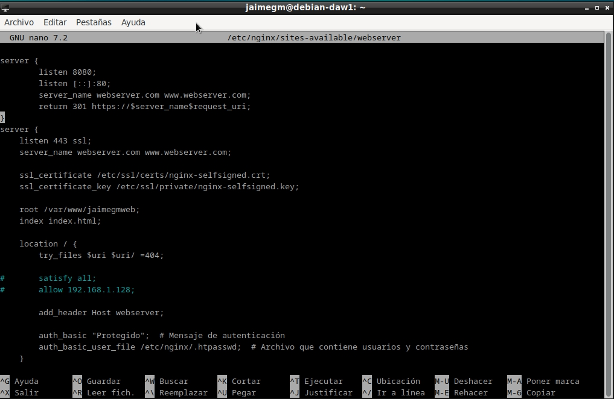
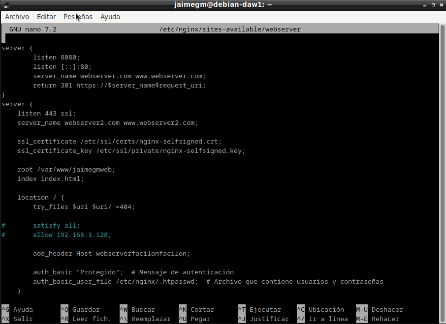
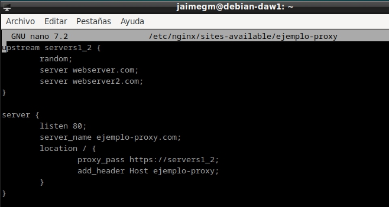
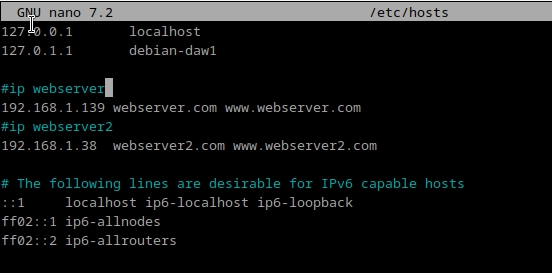
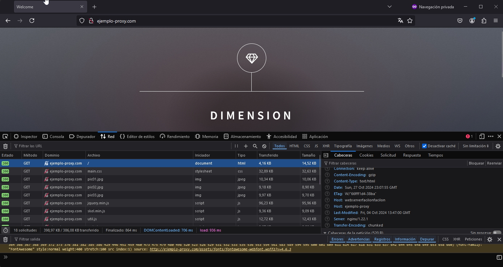
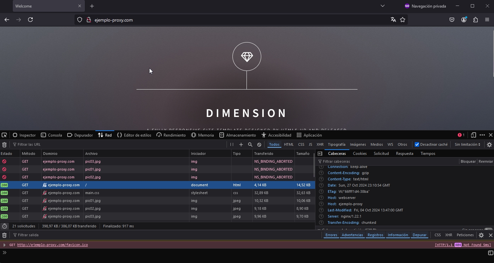

# Práctica 2.4 – Balanceo de Carga con Proxy Inverso en Nginx

### Jaime Grueso Martin

## Indice
1. [Configuraciones](#id1)
    1. [Nginx Servidor Web 1](#id11)
    2. [Nginx Servidor Web 2](#id12)
    3. [Nginx Proxy Inverso](#id13)
2. [Comprobaciones](#id2)
    1. [Comprobación del balanceo de carga cuando cae un servidor](#id21)
3. [Cuestiones finales](#id3)

# Configuraciones
Se configurararán los servidores web Nginx con dos máquinas Debian y se reutilizará el proxy inverso Nginx. 

Cada servidor web presentará un sitio web específico.

El webserver2 deberá tener la IP asignada de forma fija mediante la configuración DHCP.

El proxy inverso se configurará para que realice el balanceo de carga.

Se realizarán las peticiones HTTP desde unl navegador web de nuestra máquina anfitriona.

Se accderá a `http://balanceo` y se observará que las peticiones, se van repartiendo entre el servidor 1 y el 2.

## Nginx Servidor Web 1
Se configurará la máquina debian original como `webserver`, se hará que siga escuchando el puerto 8080 como 
anteriormente y se le añadirá una cabecera.

## Nginx Servidor Web 2
Se configurará la máquina clonada de la original como `webserver2`, se cambiará el servername del los arvhivos de configuracion a `webserver2` y se hará que siga escuchando el puerto 8080 y se le añadirá una cabecera distinta a la que se ha añadido en el
servidor web 1.

## Nginx Proxy Inverso
Se procederá a a configurar el proxy inverso para que realice el reparto de peticiones:
En el archivo de configuración se creará un bloque `upstring` con un nombre y que englobe 
a los dos servidrs web previamente configurados.

Se modificará tambien el archivo /etc/hosts para añadir tambien la ip de la máquina clonada.

## Comprobaciones
Se podrá seguir accediendo al sitio web sin problemas, si mantenemos pulsado F5, cada vez se cambiará la
cabecera del servidor. Primeramente se ha obtenido el siguiente resultado (la cabecera del segundo webserver).

Y depues se ha obtenido este resultado (la cabecera del primer webserver).

## Comprobación del Balanceo de Carga Cuando Cae un Servidor
Si se pausa o si deja directamente de funcionar alguno de los dos servidores que se han configurado,
las peticiones se envían al que aún sigue funcionando.

En este caso, se ha parado el servidor nginx 1 y se ve que se aparece la cabecera que se ha
configurado en el servidor nginx 2. Si se hiciera de manera contraria, aparecería la cabecera de
del servidor nginx 1.

# Cuestiones Finales

## Cuestion 1
**Busca información de qué otros métodos de balanceo se pueden aplicar con Nginx y describe al menos 3 de ellos.**

**IP Hash:** Usa la IP del cliente para asignarlo siempre al mismo servidor, útil para sesiones persistentes. Sin embargo, puede romper sesiones si el servidor asignado cae.

**Least Time:** Envía las solicitudes al servidor con el menor tiempo de respuesta, ideal para reducir latencia. Es más complejo de configurar, ya que requiere medición continua del tiempo de respuesta.

**Random con Peso:** Asigna las solicitudes aleatoriamente, pero permite asignar más carga a servidores con mayor capacidad. Es flexible, aunque necesita ajustes manuales si la capacidad de los servidores cambia.

## Cuestion 2
Para añadir dos servidores web adicionales al balanceo de carga en Nginx, edita el archivo de 
configuración y localiza el bloque upstream donde están definidos los servidores actuales. 
Agrega los nuevos servidores (backend3.example.com y backend4.example.com) al bloque, 
quedando así con cuatro servidores en total. Luego, verifica la configuración ejecutando 
`sudo nginx -t` y aplica los cambios recargando Nginx con sudo systemctl reload nginx. 
Esto permitirá balancear el tráfico entre todos los servidores configurados.

## Cuestion 3
Se añadirán cabeceras identificativas a los webserver, se les cambiará el parámetro `server_name` en sus respectivos
arvhivos de configuración y se añadirán las ips de cada webserver a el archivo `/etc/hosts` de la máquina que alberga
el proxy y en el archivo de configuracion de este, se añadirá un bloque upstream con los nombres de los webservers.
Por ultimo el `proxy_pass`, cambiará al nombre que se le haya asignado al bloque upstream.